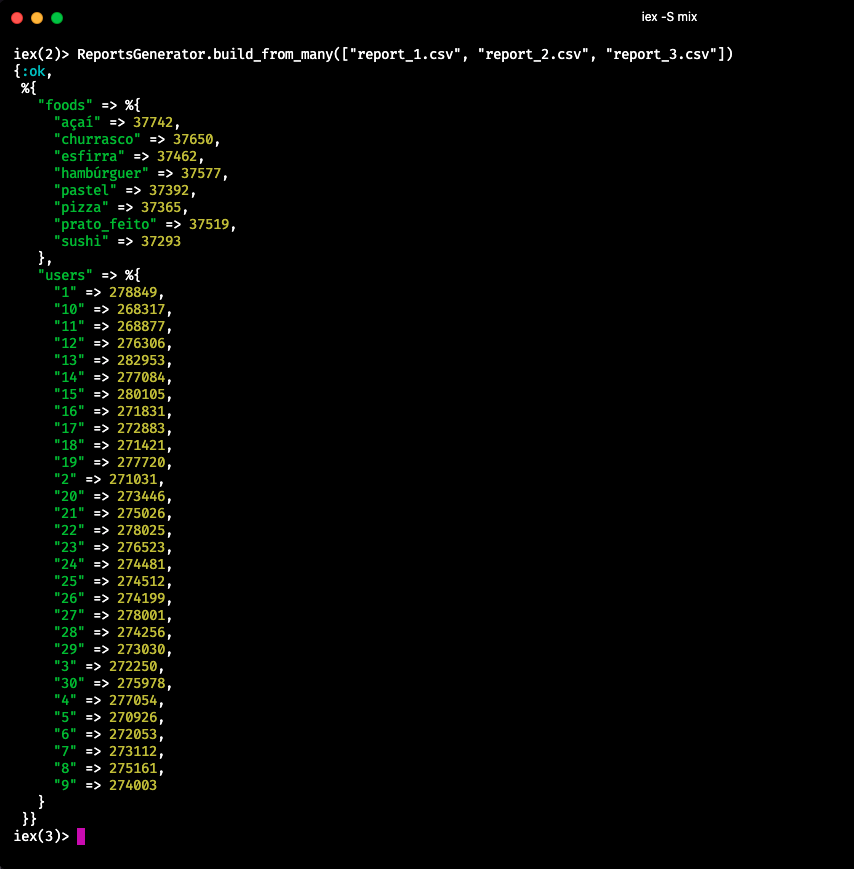

# Elixir - Reports Generator

Projeto feito em Elixir para criação de relatórios a partir de arquivos CSV.


## Licença

[](https://github.com/tterb/atomic-design-ui/blob/master/LICENSEs)


## Stack utilizada

**Back-end:** Elixir, Credo - Analizador sintático


## Clonando e rodando o projeto

Para clonar esse projeto rode

```bash
git clone https://github.com/fabramosdev/elixir-reports-generator.git
```

Baixe as dependencias do projeto

```elixir
mix deps.get
```

Use o terminal interativo do Elixir

```elixir
iex -S mix
```
## Uso/Exemplos

```elixir
iex(1)> ReportsGenerator.build("report_test.csv")
%{
  "foods" => %{
    "açaí" => 1,
    "churrasco" => 2,
    "esfirra" => 3,
    "hambúrguer" => 2,
    "pastel" => 0,
    "pizza" => 2,
    "prato_feito" => 0,
    "sushi" => 0
  },
  "users" => %{
    "1" => 48,
    "10" => 36,
    "11" => 0,
    "12" => 0,
    "13" => 0,
    "14" => 0,
    "15" => 0,
    "16" => 0,
    "17" => 0,
    "18" => 0,
    "19" => 0,
    "2" => 45,
    "20" => 0,
    "21" => 0,
    "22" => 0,
    "23" => 0,
    "24" => 0,
    "25" => 0,
    "26" => 0,
    "27" => 0,
    "28" => 0,
    "29" => 0,
    "3" => 31,
    "30" => 0,
    "4" => 42,
    "5" => 49,
    "6" => 18,
    "7" => 27,
    "8" => 25,
    "9" => 24
  }
}
```


## Métodos

Criar relatório com lista completa (300 mil linhas):

```elixir
ReportsGenerator.build("report_complete.csv")
```

De forma paralela, criar relatório com listas fracionadas (100 mil linhas cada):

```elixir
ReportsGenerator.build_from_many(["report_1.csv", "report_2.csv", "report_3.csv"])
```

Relatório de quem mais gastou:

```elixir

#passando via Pipe operator o arquivo csv

"report_complete.csv"
|> ReportsGenerator.build()
|> ReportsGenerator.fetch_higher_cost("users")
{:ok, {"13", 282953}} #Retorno de quem mais gastou
```

Relatório do alimento mais consumido:

```elixir

#passando via Pipe operator o arquivo csv

"report_complete.csv"
|> ReportsGenerator.build()
|> ReportsGenerator.fetch_higher_cost("foods")
{:ok, {"açaí", 37742}} #Retorno do alimento mais consumido
```

## Screenshots




## Autores

- [@fabramosdev](https://www.github.com/fabramosdev)
- [@rafaelcamarda](https://www.github.com/RafaelCamarda) - Educator Roocketseat
